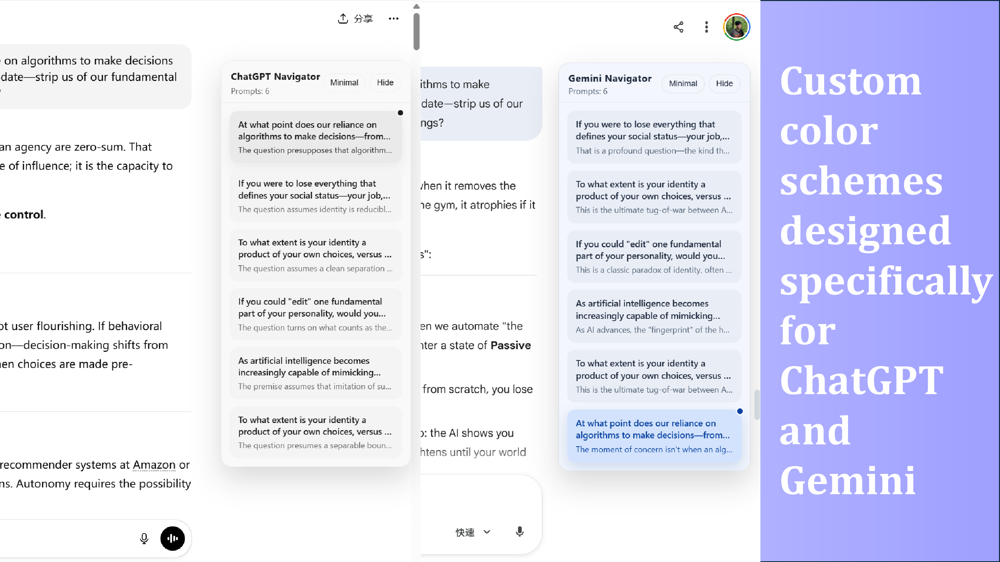
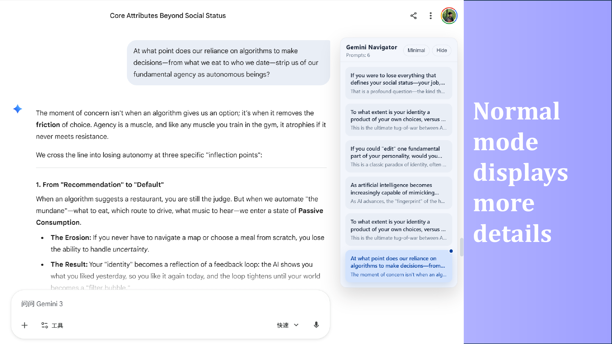
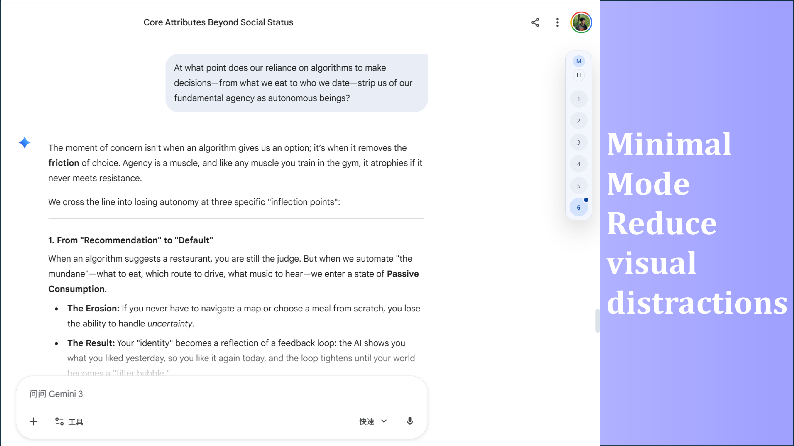
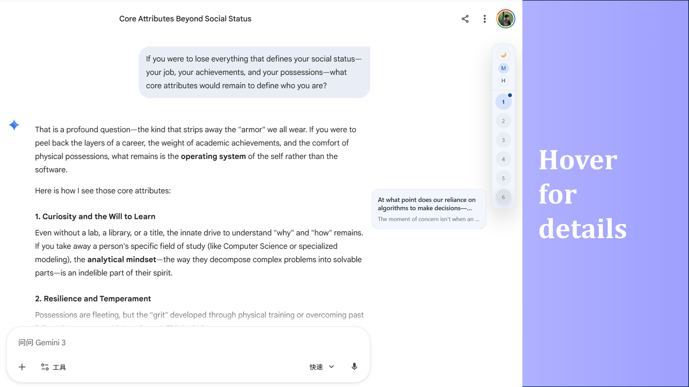
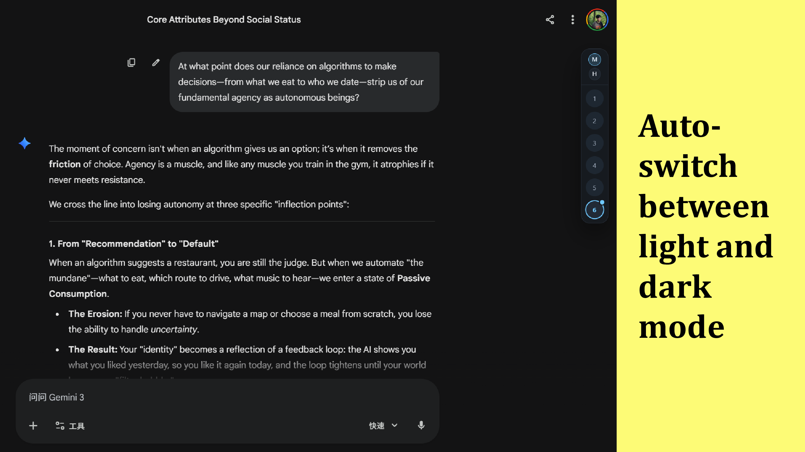

  

# JumpNav

JumpNav 是一款为 **ChatGPT、Gemini、Claude** 打造的悬浮侧边导航插件。
它会把长对话自动整理成可点击目录，并展示提问与回复预览，帮助你快速回到关键上下文。

**语言**：**简体中文** | [English](README_EN.md)

> 当前版本：**v3.6.0**

## 本次更新（v3.6.0）

- Prompt Library 新增“编辑提示词”能力，可直接从列表项进入编辑态并保存修改，无需删除后重建。
- 补齐编辑流程的状态管理，支持在标题补全流、重复标题校验和保存按钮文案之间正确切换创建态与编辑态。
- 调整提示词列表操作区布局与标题显示策略，避免操作按钮挤压内容，并保持列表交互更稳定。
- 同步补充中英德西日多语言文案、更新版本号与发布文档，发布 `v3.6.0`。

## Chrome Web Store（推荐安装）

已上架 Chrome Web Store，推荐从商店安装以获得自动更新。

[JumpNav: The most elegant AI chat navigator you’ve ever seen.](https://chromewebstore.google.com/detail/chatgpt-gemini-quick-navi/kkemkfabmgjcjlileggigaaemcheapep)

## 本地开发

- 安装依赖：`npm install --cache .npm-cache`
- 类型检查：`npm run typecheck`
- 开发调试：执行 `npm run dev`
- 首次加载：在 `chrome://extensions` 中启用开发者模式，选择“加载已解压的扩展程序”，然后加载仓库下的 `dist/` 目录
- 日常开发：保持 `npm run dev` 运行，脚本会监听构建产物与 `public/` 目录变更，并通过开发期自动重载刷新扩展或页面；如果当前站点标签页没有自动应用最新内容脚本，再手动刷新该页面一次
- 生产构建：执行 `npm run build`
- 项目专属收尾 Skill：可显式使用 [`jumpnav-release-sync`](.codex/skills/jumpnav-release-sync/SKILL.md) 检查改动、同步文档、升级版本并生成本地提交

## 核心价值

- **少滚动，多思考**：把超长聊天转成结构化导航，减少反复翻找。
- **即点即达**：点击条目即可平滑跳转到对应提问位置。
- **低打扰体验**：面板可隐藏、可拖拽，并记忆隐藏状态与位置，不影响主阅读区。

## 功能清单

- 自动提取用户提问并生成可点击导航目录，支持 ChatGPT、Gemini、Claude。
- 内置 Prompt Library，可保存、编辑常用提示词，并支持搜索、复制、删除与复用。
- 支持将提示词一键注入当前站点输入框；若站点受限，也可退回复制后手动粘贴。
- 导航条目支持鼠标点击和键盘 `Enter` / `Space` 跳转到对应消息。
- 自动跟踪当前阅读位置，高亮当前条目并自动保持当前条目可见。
- 提供简约模式（Minimal）和自适应简约模式（面板与正文重叠时自动切换）。
- 简约模式下支持悬停/聚焦预览回答内容，点击预览可直接跳转。
- 支持一键 `Hide` / `Fab` 展开，刷新后保持隐藏或展开状态，并记忆 `Fab` 位置。
- 导航面板支持亮暗主题切换，并自动跟随站点主题变化（含过渡动画）。
- 支持 SPA 路由变化与消息流式更新的自动重建，无需手动刷新扩展。
- 内置多语言文案体系，当前覆盖简体中文、英文、德文、西班牙文、日文。
- 内置使用里程碑统计，会根据累计使用天数和关键操作次数，在达标后引导用户进行商店评分或 GitHub Star。
- 公式点击复制支持 MathML / LaTeX：默认复制 MathML，`Shift+Click` 复制 LaTeX。
- 公式 MathML 引擎支持 MathJax / KaTeX / Auto，并在 Popup 中可配置与持久化。
- 内置公式提取兼容逻辑，覆盖 KaTeX、MathJax、`data-math`、`annotation` 等常见结构。

## 界面预览

**正常模式**

**简约模式**

**界面预览 3**

**界面预览 4**

**界面预览 5**

## 支持站点

- `chatgpt.com`
- `gemini.google.com`
- `claude.ai`

## 致谢

- 主题切换扩散动画参考了 [urzeye/ophel](https://github.com/urzeye/ophel) 的实现思路。

## 许可证

CC BY-NC-SA 4.0（知识共享署名-非商业性使用-相同方式共享）

- ✅ 可以自由使用、复制、修改和分发
- ✅ 必须署名（注明原作者）
- ❌ 不可用于商业目的
- ✅ 修改后的作品必须采用相同许可证

详见：[CC BY-NC-SA 4.0 许可证完整文本](https://creativecommons.org/licenses/by-nc-sa/4.0/deed.zh)
